[github](https://github.com/rectcircle/dot-learn)

官方文档图片是乱放的与章节不匹配

> [官方网站](http://www.graphviz.org/)
> 
> 原版：[dotguide](https://graphviz.gitlab.io/_pages/pdf/dotguide.pdf)
> 
> 参考博客：
> * [翻译](http://gashero.iteye.com/blog/1748795)
> * [博客1](http://blog.jobbole.com/94472/)
> * [博客2](https://my.oschina.net/Tsybius2014/blog/617963)
> * [博客3](https://blog.csdn.net/ac_dao_di/article/details/57427609)
> * [博客4](https://www.cnblogs.com/CQBZOIer-zyy/p/5702169.html)

dot用于绘制带有层次的有向图。可以运行于命令行模式、WEB可视化服务、或兼容的图形接口。功能包括图表自动布局、边缘连接、边缘标签、用端口记录图形来画数据结构、集群布局、底层文件面向流的图形工具。SML-NJ的简化模块依赖图在3 GHz Intel Xeon上花费0.23秒的用户时间编译完成。

<!-- @import "[TOC]" {cmd="toc" depthFrom=2 depthTo=6 orderedList=false} -->

<!-- code_chunk_output -->

* [1 简单图形绘制](#1-简单图形绘制)
* [2 绘制属性](#2-绘制属性)
  * [2.1 节点形状](#21-节点形状)
  * [2.2 标签](#22-标签)
  * [2.3 HTML-like 标签](#23-html-like-标签)
  * [2.4 图形样式](#24-图形样式)
    * [`color`](#color)
    * [`style`](#style)
    * [边的箭头](#边的箭头)
  * [2.5 绘图方向、大小和间隔](#25-绘图方向-大小和间隔)
  * [2.6 结点与边定位](#26-结点与边定位)
* [3 高级特性](#3-高级特性)
  * [3.1 结点端口](#31-结点端口)
  * [3.2 Clusters](#32-clusters)
  * [3.3 Concentrators集中器](#33-concentrators集中器)
* [4 命令行参数](#4-命令行参数)
* [5 杂项](#5-杂项)
* [6 总结](#6-总结)
* [7 致谢](#7-致谢)
* [引用](#引用)
* [附录](#附录)
  * [A 节点主要属性](#a-节点主要属性)
  * [B 边主要属性](#b-边主要属性)
  * [C 图主要属性](#c-图主要属性)
  * [D、E、F](#d-e-f)
  * [G Layers](#g-layers)
  * [H 形状](#h-形状)
  * [I 箭头类型](#i-箭头类型)
  * [J 颜色名](#j-颜色名)

<!-- /code_chunk_output -->

## 1 简单图形绘制

dot用于绘制有向图。他读取描述图像属性的文本文件生成图片如GIF、PNG、SVG、PDF或者PostScript。

dot绘图分为4个步骤，了解这些有助于你理解你需要何种dot布局和如何控制他们。布局程序依赖于没有循环的图表。所以

* 第一步就是打破当前图表中形成循环的边缘。
* 第二步是指定各个结点的离散层级。在一个从上到下的图表，dot会按照Y轴构造层级跨越超过一层的。超过一层的边缘需要使用虚拟节点来打破成单位长度。
* 第三步排序结点避免交叉。
* 第四步设置X轴保持边缘最短，并且作为最后一步路由各个边缘连接点。这是大多数分级有向图的绘制程序，基于 Warfield [War77] 、 Carpano [Car80] 和 Sugiyama [STT81] 。我们引用了 [GKNV93] 用于解释dot的算法。

dot主要包含三种对象：图、节点、边

* 图包含节点、边和子图
* 图、节点、边都有自己的属性

例子1 简单例子

* 第一行和最后一行形成一个代码块。定义了一个名为`G`的图（digraph）
* 每一条语句以`;`结束，就像C语言一样
* 符号与词汇，之间使用空格分割
* 首次出现的词汇为节点，如`main`
* `->` 表是一个有箭头的边

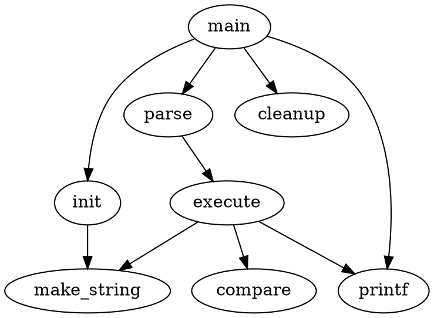

## 2 绘制属性

完整属性列表[参见](
http://www.graphviz.org/doc/info/attrs.html)

属性以键值对的形式书写，格式为`key=value`

* 图的属性直接以`key=value;`写在`{}`内
* 边与节点的属性写在其后面的`[]`内多个以`,`分割

例子2 属性

* `size="4,4";` 定义了图（digraph）的属性，表示图的大小为4*4英寸
* `main [shape=box];` 定义了一个节点，名字为`main`，形状为盒子（矩形）
* `main -> parse [weight=8];` 定义了一条边，宽度为8
* `execute -> {make_string; printf}` 定义了两条线
* `make_string [label="make a\nstring"];` 定义了一个节点，标签里显示的内容为label的内容
* `edge [color=red];` edge是个保留字，修改边的默认属性，仅对之后的元素生效
* `node [shape=box, style=filled, color=".7 .3 1.0"];` node是个保留字，修改节点的默认属性，仅对之后的元素生效

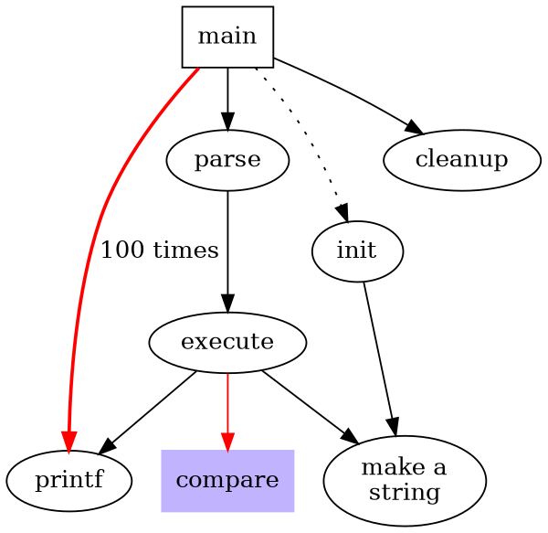

### 2.1 节点形状

节点形状默认属性为：`shape=ellipse, width=.75, height=.5`。

形状常用的有，`box`, `circle`, `polygon`, `record`, `Mrecord` 和 `plaintext`（无边框）

结点形状可以归于两大类：多边形和记录。除了 `record` 和 `Mrecord` 以外都可以归于多边形，并且可以用有限的边和几何属性来定义。

可以在图中定义的全局属性有

* `regular=true` 强制绘制为正多边形
* `peripheries=2` 边框数目
* `orientation` 属性指定多边形的曲线方向和角度

形状 `polygon` 可以指定所有多边形参数，适用于创建自定义形状。附加参数除了 `regular` 、 `peripheries` 和 `orientation` 等等，还有数字化参数：

* `sides` 表示多边形的边数
* `skew` 是一个-1.0到1.0之间的浮点数，指从上到下的倾斜度
* `distortion` 用于从上到下缩短多边形，负数表示增加。可以用于把矩形变成梯形。

例子3 节点形状

* `a` 节点设置成五边形，绘制三条边，使用浅蓝色填充
* `b` 默认
* `c` 为平行四边形，标签为hello world
* `d` 为三角形
* `e` 为梯形

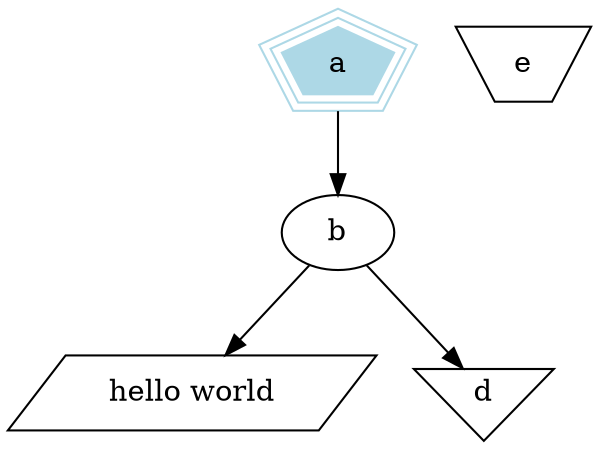

### 2.2 标签

图和子图也可以有标签。图形标签默认显示在正下方。设置 `labelloc=t` 可以把标签放在正上方。

分组标签放在矩形边框内，在左上角。设置 `labelloc=b` 可以把标签放到矩形下边，而设置 `labeljust=r` 可以放到右侧。

边的标签在边缘中间的一侧。要小心边标签与结点标签太近时发生的混淆。`decorate=true` 则画线时会把标签嵌入其中。

边还拥有附加标签。使用 `headlabel` 和 `taillabel` 来设置近端和远端的边缘标签。这些标签会放置在边缘和结点的交汇处。想要调整，可以设置 `labelangle` 和 `labeldistance` 属性。调整边缘与结点间的角度，后面那个调整边缘到结点的距离的比例参数。

而标签也可以单独设置字体，使用 labelfontname 、 labelfontsize 和labelfontcolor 。

缺省字体是 `14-point Times-Roman black` 。其他字体族，大小和颜色可以使用 `fontname` 、 `fontsize` 、 `fontcolor` 来设置

节点的默认标签为节点名，其中当节点形状属性`shape=recode`或`shape=Mrecord`时，`label=""`属性的语法如下

* 保留字符为`|<>{}\`，使用这几个字符需要使用`\`转移，支持`\n`换行
* `|`表示分割区域
* `{}` 用于横向纵向分割；偶数个`{}`嵌套，区域横着分，奇数个`{}`嵌套，区域纵者分
* `<子区域名>` 为该区域创建一个名字，在连线的时候可以指定出点，语法为`nodeName:子区域名`

例子4 records 与 label

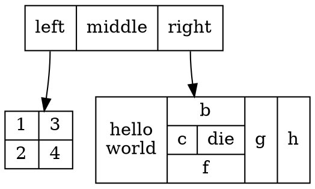

### 2.3 HTML-like 标签

节点形状属性`shape=recode`或`shape=Mrecord`时，label可以使用HTML语法进行绘制，此时使用`label=<>` （是`<>`不是`""`）

例子5  HTML-like labels

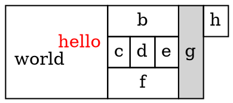

### 2.4 图形样式

#### `color`

结点和边可以指定`color`属性，默认是黑色。这是绘制结点形状和边时使用的颜色。`color`表示语法有一下几种：

* `color="0.8396,0.4862,0.8549"` RGB从0到1灰度值
* `color="#DA70D6"` RGB十六进制表示法
* `color="red"` 预设有名称的颜色

#### `style`

`style` 属性控制图形中结点和边的样式。这个属性是以逗号分隔的一列参数。共有如下几组：

* 线性
  * `solid` 实线
  * `dashed` 虚线
  * `dotted` 点线
  * `bold` 粗线
  * `invis` 不画线
* `filled` 表示使用`fillcolor`（优先）或`color`（备选）填充
* `diagonals` 绘制对角线
* `rounded` 圆角

#### 边的箭头

`dir`用于设置边箭头的方向

* `forward` (缺省)
* `back` 反向绘制箭头
* `both` 双箭头
* `none` 不绘制箭头

`arrowhead` 与 `arrtail` 用于设置箭头的样式

* normal
* inv
* dot
* invdot
* odot
* invodot
* none

`arrowsize=2` 设置箭头尺寸

`arrowhead="empty"` 表示箭头为空心

### 2.5 绘图方向、大小和间隔

* `nodesep` 指定了以英寸为单位的最小占用空间，在同一范围内临近的两个结点的最小距离。
* `ranksep` 指定了各个层次(rank)之间的间隔，就是在上一个rank中最下那个node到下一个rank中最上那个node之间的距离，单位是英寸。`ranksep=equally`可以使所有的rank拥有相同的间隔空间，特别适合于中心结点对旁边的结点进行等距离分配。
* `size="x,y"` 这会先决定于最终布局的大小。例如， `size="7.5,10"` 会适应8.5x11的页面(假设缺省页方向)而无论初始布局有多大。
* `ratio` 也作用于布局大小。依赖于size和ratio的设置

### 2.6 结点与边定位

`rankdir` 用于配置默认边的方向默认是从上到下

* `rankdir=LR` 从左到右
* `rankdir=BT` 从下到上

`rank` 在子图设置排列

* `same` ：让子图继承相同的排列
* `min` ：子图中所有结点至少比布局中其他结点的排列(rank)要小
* `source` ：强制子图所有结点严格基于某个排列，同时比其他结点排列要小(除非这些子图也指定了min或source)(?)
* `max` 或 `sink` ：做与最大排列接近的事情。

例子6

* 默认线是从上到下的，所以节点排序是从左到有
* 一个`{}`代表一个子图
* `{rank="same";}` 表示该子图排列和父图一致

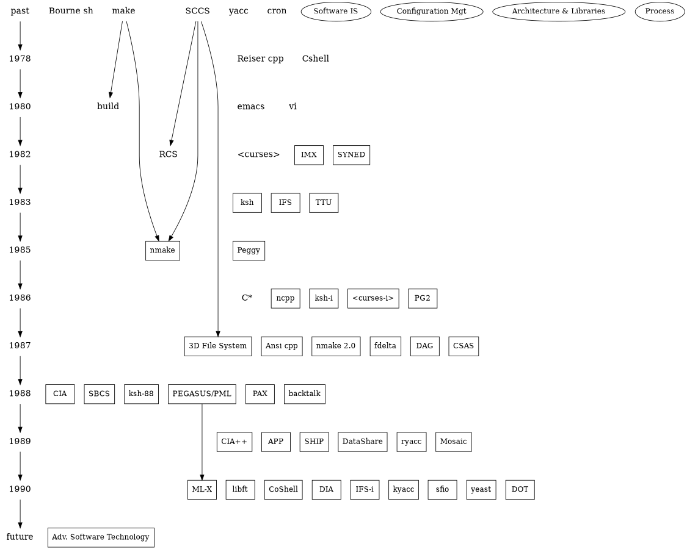

## 3 高级特性

### 3.1 结点端口

节点端口指的是线从节点的那个位置出发，默认是自动选择。默认可选的配置为：

* "n"
* "ne"
* "e"
* "se"
* "s"
* "sw"
* "w"
* "nw"

字母表示东南西北，写法有两种：

* `a -> b [tailport=se]`
* `a -> b:se`

当使用了 `record` ，且在标签中使用`<f0>`，则可以如下指定

* `a -> b:f0:se`

例子7 二叉树

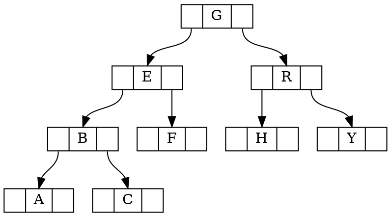

例子9 Hash表

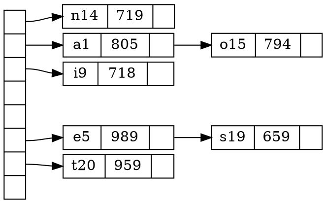

### 3.2 Clusters

cluster是一个子图，定位于一个举行区域中，并有自己的布局。一个子图被认为是一个cluster，如果其名字拥有前缀 cluster 。(如果顶级图有clusterrank=none ，那么这个处理就被关闭了。)标签、字体和 labelloc 属性可以设置顶级图形，然而cluster标签则是缺省显示的。对于cluster，标签默认左对齐，如果 labeljust="r" 则标签就右对齐了。 color 属性指定了包围矩形的颜色。另外，cluster可以有 style="filled" ，先定义包围矩形的颜色为fillcolor 。如果没指定fillcolor，则使用cluster的color属性。

cluster的绘制通过递归技术，计算分配的rank和内部结点的布局。下面Finger17-19是cluster的例子。

例子10

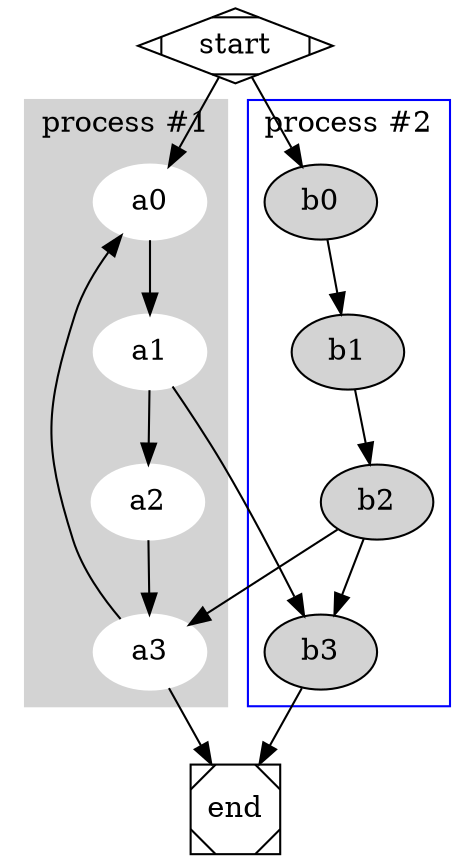

例子11

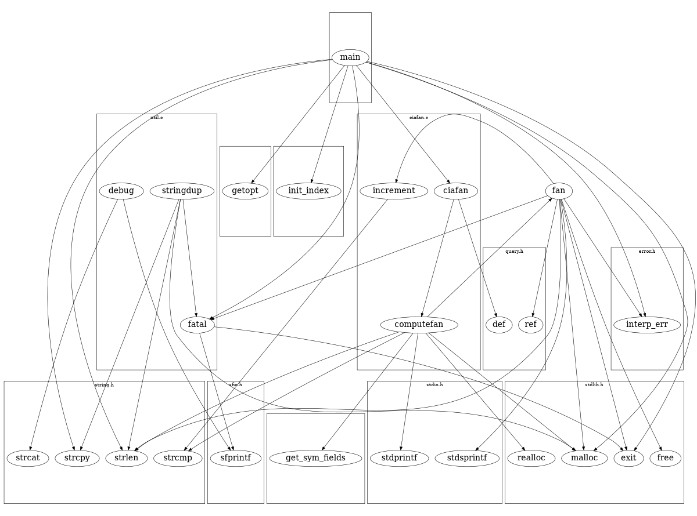

例子12

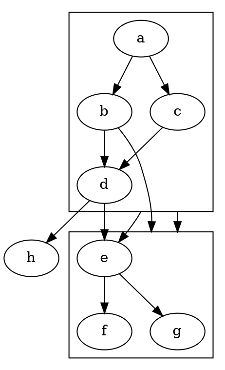

### 3.3 Concentrators集中器

`concentrate=true` 表示启用集中器，使边合并，减少混乱

例子13

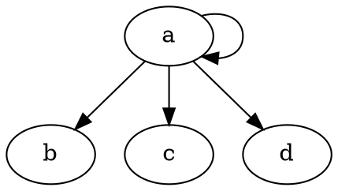

## 4 命令行参数

略

## 5 杂项

在顶级图之前，可以声明 `strict digraph` 。这会禁止自引用(self-arcs)和多条边缘(multi-edges)。他们会在输入文件中自动忽略。

## 6 总结

略

## 7 致谢

略

## 引用

略

## 附录

### A 节点主要属性

|名称 | 缺省值 |值 |
|-----|-------|---|
|color | black |结点颜色 |
|colorscheme | X11  | 颜色模式 |
|comment |   |字符串，(format-dependent) |
|distortion | 0.0 | 供 shape=polygon 使用的结点扭曲 |
|fillcolor | lightgrey/black | 结点填充色 |
|fixedsize | false |标签文字不影响结点大小 |
|fontcolor | black |字体颜色 |
|fontname | Times-Roman |字体名 |
|fontsize | 14 |字体大小 |
|group | -- |节点所属的组 |
|height | .5 |以英寸为单位的高度 |
|id    |     |任意字符串(user-defined output object tags)|
|image |      | 图片文件名|
|imagescale| false |true, width, height, both |
|label | 结点名 |任意字符串 |
|labelloc | c  | 节点标签垂直对齐|
|layer | 覆盖范围 |all、id 或 id:id或以逗号分隔的列表 |
|margin | 0.11,0.55 | 标签周围的空白 |
|nojustify | false |if true, justify to label, not node|
|orientation | 0.0 | 结点旋转角度 |
|penwidth | 1.0 | 用于绘制边界的笔的宽度，以磅为单位 |
|peripheries | shape-dependent | 节点边的数目 |
|regular | false |使多边形变得规则 |
|samplepoints | 8 or 20 | |
|shape | ellipse |结点形状 |
|sides | 4 |shape=polygon 时边的数量 |
|skew | 0.0 | shape=polygon 时的相位差（倾斜角度） |
|style | -- |图形选项，例如 bold 、 dotted 、 filled 等 |
|target |   | if URL is set, determines browser window for URL|
|tooltip | | 标签工具提示注释|
|URL | -- |指定结点的URL(format-dependent) |
|width | .75 |以英寸为单位的宽度 |

### B 边主要属性

|名称 |缺省值 | 值|
|----|-----|----|
|arrowhead |normal | 箭头的样式|
|arrowsize |1.0 | 箭头缩放的比例因子|
|arrowtail |normal | 箭头尾部的样式|
|color |black | 边缘的颜色|
|comment |-- | 任意字符串，依赖于格式|
|constraint |true | 强制约束，通过边限制结点范围|
|decorate |-- | 修饰，如果设置了，线的标签会嵌入到线中|
|dir |forward | forward,back,both,none|
|edgeURL| | URL attached to non-label part of edge|
|edgehref| | synonym for edgeURL|
|edgetarget| | if URL is set, determines browser window for URL|
|edgetooltip| label | tooltip annotation for non-label part of edge|
|fontcolor |black | 字体颜色|
|fontname |Times-Roman |字体族|
|fontsize |14  | point size of label|
|headclip |true | if false, edge is not clipped to head node boundary|
|headhref | |synonym for headURL|
|headlabel |-- | 箭头标签|
|headport |-- | n,ne,e,se,s,sw,w,nw|
|headtarget | | if headURL is set, determines browser window for URL|
|headtooltip |label |  tooltip annotation near head of edge|
|headURL |-- | 如果输出格式为ismap时，标签附上URL|
|href | | alias for URL|
|id | | any string (user-defined output object tags)|
|label |-- | 边缘标签|
|labelangle |-25.0 | 边缘标签的旋转角度|
|labeldistance |1.0 | 边缘标签距离结点的比例因子|
|labelfloat |false | 边缘标签位置的强制约束|
|labelfontcolor |black | 标签字体颜色|
|labelfontname |Times-Roman | 标签字体族|
|labelfontsize |14 | 标签字体大小|
|labelhref| | synonym for labelURL|
|labelURL| | URL for label, overrides edge URL|
|labeltarget| | if URL or labelURL is set, determines browser window for URL|
|labeltooltip |label| tooltip annotation near label|
|layer |overlay range| all,id,或id:id|
|lhead |-- | 箭头使用的簇(cluster)的名字|
|ltail |-- | 箭尾使用的簇(cluster)的名字|
|minlen |1 | 头尾间最小长度|
|penwidth | 1.0 | 用于绘制边的笔的宽度，以磅为单位 |
|samehead |-- | 头结点的tag，拥有相同头结点tag的边缘会使用统一端点|
|sametail |-- | 同上，尾结点|
|style |-- | 图形选项，例如bold,dotted,filled|
|tailclip | true| if false, edge is not clipped to tail node boundary|
|tailhref| | synonym for tailURL|
|taillabel |-- | 箭尾标签|
|tailport |-- | n,ne,e,se,s,sw,w,nw|
|tailtarget|  |if tailURL is set, determines browser window for URL|
|tailtooltip| label| tooltip annotation near tail of edge|
|tailURL |-- | 当输出格式为ismap时箭尾标签附加的URL|
|target| |if URL is set, determines browser window for URL|
|tooltip |label |tooltip annotation|
|weight |1 | 边缘的延伸花费整数|

### C 图主要属性

|名称| 缺省值 |值|
|---|------|---|
|aspect| | controls aspect ratio adjustment|
|bgcolor| -- |画图的背景图|
|center| false |在page的中心画图|
|clusterrank| local |global或none|
|color| black |对cluster,outline颜色等等的没有指定fillcolor时的默认颜色|
|colorscheme| X11| scheme for interpreting color names|
|comment| -- |注释|
|compound| false |允许cluster之间的边缘|
|concentrate| false |允许边缘的集中|
|dpi | 96 | dots per inch for image output|
|fillcolor| black |cluster的填充色|
|fontcolor| black |字体颜色|
|fontname| Times-Roman | 字体族|
|fontnames| | svg, ps, gd (SVG only)|
|fontpath| -- |字体搜索路径|
|fontsize| 14 |字体大小|
|id| | any string (user-defined output object tags)|
|label| -- |任意字符串|
|labeljust| centered |l和r用于cluster标签的左对齐和右对齐|
|labelloc| top |t和b用于cluster标签的上对齐和下对齐|
|layers| -- |id:id:id...|
|layersep| :| specifies separator character to split layers|
|margin| .5 |page的空白，英寸|
|nodesep| .25 |结点之间的间隔，英寸|
|nojustify| false| if true, justify to label, not graph|
|ordering| -- |如果out则外部边缘顺序会保留|
|orientation| portrait |如果没用rotate，而值为landscape，使用风景画定位|
|outputorder| breadthfirst| or nodesfirst, edgesfirst|
|page| -- |标记页，例如"8.5,11"|
|pagedir| BL |多页之间的横断|
|pencolor| black| color for drawing cluster boundaries|
|penwidth| 1.0| width of pen for drawing boundaries, in points|
|peripheries| 1| number of cluster boundaries|
|rank| -- |same,min,max,source,sink|
|rankdir| TB |LR(从左向右)或TB(从上到下)|
|ranksep| .75 |等级之间的间隔，英寸|
|ratio| -- |近似朝向approximate aspect ratio desired，fill或auto|
|remincross| -- |如果为true且有多个集群，重新运行crossing最小化|
|rotate| -- |如果为90，设置朝向|
|samplepoints| 8 |输出时用以表现椭圆和圆所用的点数，参见附录C|
|searchsize| 30 |切除的最大边缘，当用以寻找网络中的最小一个(完全没看懂?)|
|size| -- |最大绘图尺寸，英寸|
|splines|| draw edges as splines, polylines, lines|
|style| -- |图形选项，例如集群的filled|
|stylesheet|| pathname or URL to XML style sheet for SVG|
|target|| if URL is set, determines browser window for URL|
|tooltip| label| tooltip annotation for cluster|
|truecolor|| if set, force 24 bit or indexed color in image output|
|viewport|| clipping window on output|
|URL| -- |图形锚点，依赖于格式|

### D、E、F

略

### G Layers

略

### H 形状

[参见](http://www.graphviz.org/doc/info/shapes.html)

### I 箭头类型

[参见](http://www.graphviz.org/doc/info/arrows.html)

### J 颜色名

* [参见1](http://www.graphviz.org/doc/info/colors.html)
* [参见2](http://www.graphviz.org/doc/info/attrs.html#k:color)

